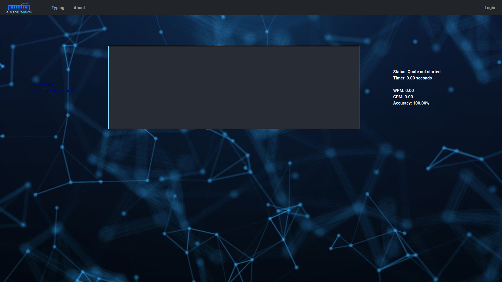

# TypeAi.de
Site to practise typing skills.

www.typeai.de
(the site doesn't work yet: the backend uses http, but browsers will block requests unless they are via HTTPS with a certificate from a trusted authority. I'm fixing that though).

Minimalist typing site with a simple UI.

## Running it:
Haven't finished completely automating everything yet. But for now it works like this:

### Backend
Simply clone the project onto a machine with docker installed, and run docker-compose up --build.
To use a previous database dump, copy it into mongodb/default_content before starting, and delete mongodb/db-data.

### Frontend
Run the npm build script, then deploy the build folder with some tool like netlify. Change the URL that the frontend uses to access the backend, include the backend's IP.

(Ideally it would host everything from one server, and spin up with just the one docker-compose call, but there's OS network configuration to be done and lots of stuff that I currently don't have the time to deal with).
